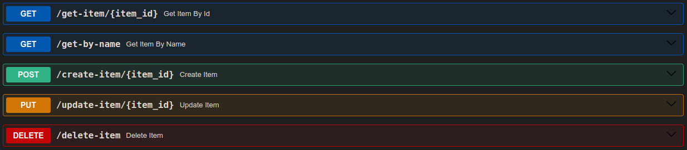

# python-fast-api
This is a simple FastAPI project for learning purposes

## Installing FastAPI
This is pretty straightforward. Simply do:
```bash
pip install fastapi uvicorn
```
Uvicorn was installed as well. It is a web server implementation for Python. More on Uvicorn [here]
(https://www.uvicorn.org/).
After installing required packages, your ```pip list``` should return something like contents of requirements.txt. Since packages are updated regularly, if you wish full compatibility with the code on this repository, do not install perform installation as shown above. Instead, do:
```bash
pip install -r requirements.txt
```
## The application
The idea is to get familiar with HTTP methods (GET, POST, PUT, DELETE).
Let's imagine this is a store and we need to be able to manage our inventory.

## Running
On your terminal, use the following command:
```bash
uvicorn fast_api:app --reload
```
Feel free to adapt to your code, replacing ```fast_api``` by whatever it is you called your python file and ```app``` by the name of choice for your FastAPI object. If everything is working, the output should be something like
```console
INFO:     Uvicorn running on http://127.0.0.1:8000 (Press CTRL+C to quit)
INFO:     Started reloader process [13818] using StatReload
INFO:     Started server process [13820]
INFO:     Waiting for application startup.
INFO:     Application startup complete.
```
From which you can get the URL (```http://127.0.0.1:8000``` or ```localhost:8000```) to access the webserver. Just open it in the browser.

## Usage
As seen before, the URL to access the server is ```localhost:8000```. FastAPI provides an interface that helps interacting with the endpoints. To use it, go to ```localhost:8000/docs``` and you should see something similar to this:



To interact with each endpoint, expand and click "Try it out". Then, fill the necessary inputs and click "Execute". It's intuitive ans easy to use.

# Testing
TO-DO: implement tests.